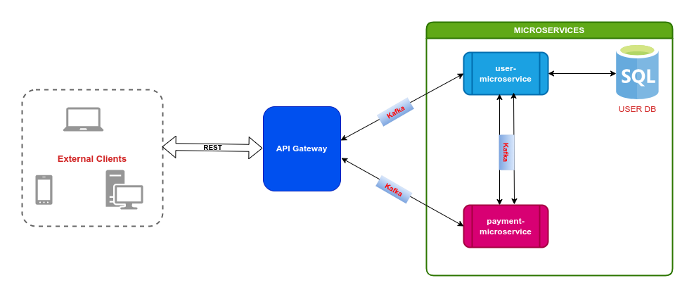

# NestJS REST API + Apache Kafka Microservices

This project is a monorepo managed by [nx](https://nx.dev) workspace, it contains a REST API with microservices using [Apache Kafka](https://kafka.apache.org/) as message broker and it is built with the [NestJS](https://docs.nestjs.com) framework.  

The project is meant for learning and evaluation purposes only. However, it could also be used to bootstrap live projects.

## Tech Stack
* [NestJS](https://docs.nestjs.com)
* [TypeScript](https://www.typescriptlang.org/)
* [PostgreSQL](https://www.postgresql.org/)
* [MongoDB](https://www.mongodb.com/)
* [TypeORM](https://typeorm.io)
* [Mongoose ODM](https://mongoosejs.com/)
* [KafkaJS](https://kafka.js.org/)
* [Nx](https://nx.dev/)
* [Docker Compose](https://docs.docker.com/compose/)

## Architecture Overview

The project currently consists of the following components:

1. API Gateway (AG): this sits in front of all microservices and listens to requests from external client, it calls the appropriate microservice(s) to process the request and sends responses back to external clients.

2. User Microservice: this microservice is integrated with an SQL database, PostgreSQL and it handles all CRUD requests for users received from the API gateway and other microservices and returns appropriate responses. Its core responsible include managing user-related operations such as creating new user accounts, updating user information, and managing authentication and authorization.

3. Payment Microservice: this microservice handles payment-related requests received from external clients through the API gateway, it communicates with the user-microservice to get the required user-related data to process requests and returns appropriate responses to the API gateway.

4. Product Microservice: this microservice is integrated with a NoSQL database, MongoDB and it is designed to manage product-related information. It handles all CRUD operations and other extended queries and responds accordingly to the API gateway. MongoDB is used for this microservice as it is well know for its flexibility and because the product schema is designed to have some data-types that is best stored in a document-based database.

4. Message Broker: Apache Kafka is used here to manage AG-microservices and inter-services communication.

5. Databases: all microservices are isolated from each other and are designed to have their own separate database as required. Both SQL (PostgreSQL) and NoSQL (MongoDB) databases are used in this app.

The application could be easily scaled, and more microservices added as required.



## Running the individual component

```
# running AG or any microservice
nx serve api-gateway
nx serve user-microservice
nx serve payment-microservice

# adding a new microservice
nx g @nrwl/nest:app microservice-name

```

## Roadmap

### Additional Features

- [ ] Add password change and reset options

- [ ] Add logout option

- [ ] Add support for refresh token

### API Gateway

- [ ] Integrate Swagger to document endpoints

- [ ] Add Unit Tests

- [ ] Improve Logging

- [ ] Improve Error handling between microservices

- [ ] Add health checks

### Microservices

- [ ] Integrate database for payments-microservice

- [ ] Setup database migration for each microservice with database integrations

- [ ] Add more features to payment-microservice

- [ ] Add more microservices

### Others

- [ ] Add more services to docker-compose to dockerize the whole app

## Credits
* [Vijit Ail](https://www.linkedin.com/in/vijit-ail-376885179)

## License

[MIT](https://choosealicense.com/licenses/mit/)


## 🔗 Links
[](https://qxz.netlify.app/)
[](https://www.linkedin.com/in/greazleay)


## Badges

[](https://choosealicense.com/licenses/mit/)
[](https://github.com/greazleay/microservices-demo/)
